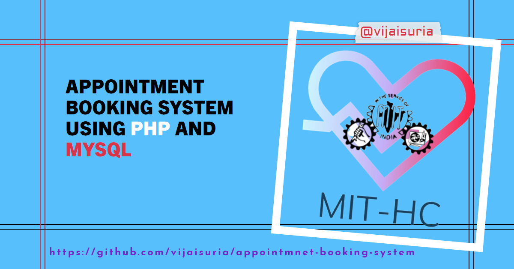

# Health Center Appointment Booking System

This appointment booking system is designed specifically for our college health center to streamline the process of scheduling and managing appointments for students and staff. Built using PHP, HTML, Bootstrap, and MySQL as the database, it provides a user-friendly interface and efficient functionalities.

## Features

### User Functions

- **Appointment Scheduling:** Students and staff can easily book appointments with healthcare professionals.
- **Prescription Management:** Access and manage prescriptions associated with appointments.
- **Medical Records:** View comprehensive medical history and past appointments.
- **Profile Management:** Update personal information and preferences.
- **Feedback Submission:** Provide feedback regarding the health services received.

### Admin Functions

- **Appointment Approval/Rejection:** Admins have the privilege to approve or reject appointments.
- **Appointment List:** View a comprehensive list of scheduled appointments.
- **Email Notifications:** Automatic notifications to users for appointment confirmation, rejection, and booking.

## System Overview

### Technologies Used

- **PHP:** Backend logic and server-side functionality.
- **HTML & Bootstrap:** Frontend design for a user-friendly interface.
- **MySQL:** Database management for storing user and appointment information.
- **Email Integration:** Notifications sent to users on various actions (confirmation, rejection, booking).

### How to Use

1. **Installation:** Set up the system by importing the database and configuring the necessary files.
2. **User Access:** Students and staff can log in to access their profiles, schedule appointments, view medical records, and provide feedback.
3. **Admin Access:** Admins can log in to approve or reject appointments, view the appointment list, and manage system settings.

## Usage Guide

1. **User Dashboard:** Upon logging in, users are directed to their dashboard displaying upcoming appointments, medical history, and options to schedule new appointments, update profiles, etc.
2. **Admin Panel:** Admins have a separate panel to manage appointments, view user profiles, and oversee system operations.

---

## Contact

For any queries, suggestions, or issues, please contact [vijaisuria87@gmail.com](mailto:vijaisuria87@gmail.com).

- **LinkedIn:** [vijaisuria](https://www.linkedin.com/in/vijaisuria/)
- **Portfolio Website:** [vijaisuria.github.io](https://vijaisuria.github.io/)
